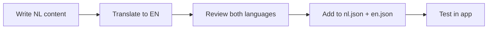

# Content Style Guide

This guide defines content standards for all user-facing text in Lumio, ensuring consistency across Dutch (primary) and English localizations.

## Table of Contents

1. [Tone and Voice](#tone-and-voice)
2. [Language Parity Rules](#language-parity-rules)
3. [Terminology Standards](#terminology-standards)
4. [Form Helper Text Guidelines](#form-helper-text-guidelines)
5. [Empty State Patterns](#empty-state-patterns)
6. [Delete Confirmation Patterns](#delete-confirmation-patterns)
7. [Error Messages](#error-messages)
8. [Accessibility Requirements](#accessibility-requirements)

---

## Tone and Voice

### Core Principles

Lumio helps users with sensitive end-of-life planning. Our content must be:

| Principle | Description | Example |
|-----------|-------------|---------|
| **Empathetic** | Acknowledge the emotional nature of the topic | "We understand this information is personal" |
| **Clear** | Use plain language, avoid jargon | "Your heir" not "beneficiary designee" |
| **Professional** | Maintain dignity without being cold | "Your wishes will be securely stored" |
| **Encouraging** | Guide users positively through difficult decisions | "You've completed 60% of your profile" |

### Formality Level

- **Dutch (NL)**: Use formal "u" form consistently, never "je/jij"
- **English (EN)**: Use "you" with professional but approachable tone

### Do's and Don'ts

| Do ✓ | Don't ✗ |
|------|---------|
| "Voeg een erfgenaam toe" | "Klik hier om erfgenaam toe te voegen" |
| "Your emergency contact" | "The user's emergency contact" |
| "Bewaar uw wijzigingen" | "Sla op" |
| "Enter your full legal name" | "Put ur name here" |

---

## Language Parity Rules

### Translation Requirements

1. **All user-facing text must exist in both NL and EN**
2. **NL is the source language** - create Dutch content first, then translate
3. **Maintain semantic equivalence** - don't translate literally if meaning is lost
4. **Keep structure parallel** - if NL has 3 sentences, EN should have ~3 sentences

### i18n Key Naming Convention

```
{domain}.{section}.{element}
```

Examples:
- `boedel.hulpteksten.bezitWaarde` → `estate.helperTexts.assetValue`
- `erfgenamen.legeStaten.titel` → `heirs.emptyStates.title`
- `verwijderBevestiging.erfgenaam.beschrijving` → `deleteConfirmation.heir.description`

### Translation Validation Checklist

- [ ] All keys in `nl.json` have corresponding keys in `en.json`
- [ ] Placeholder variables match (e.g., `{naam}` in NL, `{name}` in EN)
- [ ] Pluralization rules are applied where needed
- [ ] Special characters display correctly (ë, é, ü, etc.)

---

## Terminology Standards

### Domain-Specific Terms

| Dutch (Primary) | English | Usage |
|-----------------|---------|-------|
| Erfgenaam | Heir | Person who inherits |
| Boedel | Estate | Total assets and debts |
| Testament | Will | Legal document for inheritance |
| Wilsverklaring | Advance Directive | Healthcare wishes document |
| Uitvaartwensen | Funeral Wishes | End-of-life ceremony preferences |
| Digitaal bezit | Digital Assets | Online accounts, cryptocurrencies |
| Noodcontact | Emergency Contact | Person to contact in crisis |
| Donorregistratie | Organ Donation | Organ/tissue donation preferences |

### Consistent Phrasing

| Context | Dutch | English |
|---------|-------|---------|
| Add action | "Toevoegen" | "Add" |
| Edit action | "Bewerken" | "Edit" |
| Delete action | "Verwijderen" | "Delete" |
| Save action | "Opslaan" | "Save" |
| Cancel action | "Annuleren" | "Cancel" |
| Required field | "Verplicht" | "Required" |
| Optional field | "Optioneel" | "Optional" |

---

## Form Helper Text Guidelines

Helper texts provide guidance beneath form fields. They should:

### Structure

```
[What the field is for] + [Format/constraints if any] + [Why it matters (optional)]
```

### Length Guidelines

- **Minimum**: 10 characters
- **Maximum**: 150 characters
- **Ideal**: 40-80 characters

### Examples by Field Type

#### Text Input
```
NL: "Uw volledige naam zoals vermeld op officiële documenten"
EN: "Your full name as it appears on official documents"
```

#### Email
```
NL: "E-mailadres dat actief wordt gemonitord voor belangrijke meldingen"
EN: "Email address actively monitored for important notifications"
```

#### Date
```
NL: "Selecteer de datum in DD-MM-JJJJ formaat"
EN: "Select the date in DD-MM-YYYY format"
```

#### Currency
```
NL: "Geschatte waarde in euro's, exclusief BTW"
EN: "Estimated value in euros, excluding VAT"
```

### When NOT to Add Helper Text

- Self-explanatory fields (e.g., "Email" with email icon)
- When the label is already descriptive enough
- When space is limited in mobile views

---

## Empty State Patterns

Empty states appear when a list or section has no data. They should motivate users to take action.

### Required Elements

1. **Icon**: Relevant Lucide icon (from design system)
2. **Title**: What's missing (noun phrase)
3. **Description**: Why it matters + encouragement
4. **CTA Button**: Primary action to resolve the empty state

### Template

```tsx
<EmptyState
  icon={Users}
  title={t('emptyStates.heirs.title')}           // "No heirs yet"
  description={t('emptyStates.heirs.description')} // "Add your heirs..."
  ctaLabel={t('emptyStates.heirs.cta')}          // "Add first heir"
  onCtaClick={handleAddHeir}
/>
```

### Content Examples

| Section | Title (EN) | Description (EN) |
|---------|------------|------------------|
| Erfgenamen | "No heirs added yet" | "Start by adding the people who will inherit your estate. You can specify what each person receives." |
| Documenten | "No documents uploaded" | "Upload important documents like your will, insurance policies, or identification. Your heirs will have access when needed." |
| Bezittingen | "No assets registered" | "Add your valuable possessions, real estate, and other assets. This helps your heirs understand your estate." |

### Tone for Empty States

- **Encouraging**, not critical
- **Action-oriented** - guide toward the next step
- **Concise** - max 2 sentences for description

---

## Delete Confirmation Patterns

Delete confirmations prevent accidental data loss. They must be explicit about what's being deleted.

### Required Elements

1. **Title**: "Delete {item type}?" or "{Item type} verwijderen?"
2. **Description**: Consequences + item identifier
3. **Confirm button**: Explicit "Delete {item}" text
4. **Cancel button**: Always available

### Template Structure

```
Title: "Delete {itemType}?"
Description: "Are you sure you want to delete {itemType} '{itemName}'? This action cannot be undone."
Confirm: "Delete {itemType}"
Cancel: "Cancel"
```

### Content by Item Type

| Item Type | NL Confirm | EN Confirm |
|-----------|------------|------------|
| erfgenaam | "Erfgenaam verwijderen" | "Delete heir" |
| bezit | "Bezit verwijderen" | "Delete asset" |
| document | "Document verwijderen" | "Delete document" |
| noodcontact | "Noodcontact verwijderen" | "Delete emergency contact" |

### Never Do

- Generic "Are you sure?" without context
- Hide the item name being deleted
- Use "OK" or "Yes" as confirmation button text

---

## Error Messages

### Structure

```
[What went wrong] + [How to fix it]
```

### Examples

| Scenario | Message |
|----------|---------|
| Required field empty | "Dit veld is verplicht" / "This field is required" |
| Invalid email | "Voer een geldig e-mailadres in" / "Enter a valid email address" |
| Server error | "Er ging iets mis. Probeer het opnieuw." / "Something went wrong. Please try again." |

### Tone

- Never blame the user
- Be specific about the issue
- Always offer a path forward

---

## Accessibility Requirements

All content must meet WCAG 2.1 Level A requirements.

### Text Alternatives

- All images must have `alt` text
- Icons with meaning need `aria-label`
- Decorative icons use `aria-hidden="true"`

### Screen Reader Considerations

- Use semantic HTML (`<h1>`, `<p>`, `<button>`)
- Empty states have `role="status"` and `aria-live="polite"`
- Error messages linked via `aria-describedby`

### Color and Contrast

- Never rely on color alone to convey meaning
- Minimum contrast ratio: 4.5:1 for normal text
- Minimum contrast ratio: 3:1 for large text

### Motion

- Respect `prefers-reduced-motion` setting
- Avoid auto-playing animations

---

## Content Review Process

### Before Merging

1. **Self-review**: Author checks against this guide
2. **Spell check**: Both NL and EN content
3. **Key parity**: Verify all `nl.json` keys exist in `en.json`
4. **a11y check**: Run axe-core in development mode

### Localization Workflow



---

## Quick Reference

### Character Limits

| Element | Min | Max | Ideal |
|---------|-----|-----|-------|
| Helper text | 10 | 150 | 40-80 |
| Empty state title | 10 | 40 | 15-25 |
| Empty state description | 30 | 200 | 80-120 |
| Button label | 3 | 25 | 8-15 |
| Error message | 15 | 100 | 30-60 |

### Key Prefixes

| Prefix | Purpose |
|--------|---------|
| `hulpteksten.*` | Form helper texts |
| `legeStaten.*` | Empty state content |
| `verwijderBevestiging.*` | Delete confirmation dialogs |
| `fouten.*` | Error messages |
| `knoppen.*` | Button labels |
