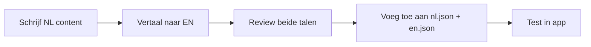

# Contentstijlgids

Deze gids definieert contentstandaarden voor alle gebruikersgerichte tekst in Lumio, om consistentie te waarborgen tussen Nederlandse (primair) en Engelse lokalisaties.

## Inhoudsopgave

1. [Toon en Stem](#toon-en-stem)
2. [Taalpariteitsregels](#taalpariteitsregels)
3. [Terminologiestandaarden](#terminologiestandaarden)
4. [Richtlijnen voor Hulpteksten](#richtlijnen-voor-hulpteksten)
5. [Lege-staatpatronen](#lege-staatpatronen)
6. [Verwijderbevestigingspatronen](#verwijderbevestigingspatronen)
7. [Foutmeldingen](#foutmeldingen)
8. [Toegankelijkheidseisen](#toegankelijkheidseisen)

---

## Toon en Stem

### Kernprincipes

Lumio helpt gebruikers met gevoelige planning rond het levenseinde. Onze content moet:

| Principe | Beschrijving | Voorbeeld |
|----------|--------------|-----------|
| **Empathisch** | Erken de emotionele aard van het onderwerp | "Wij begrijpen dat deze informatie persoonlijk is" |
| **Duidelijk** | Gebruik eenvoudige taal, vermijd jargon | "Uw erfgenaam" niet "begunstigde aangewezene" |
| **Professioneel** | Behoud waardigheid zonder kil te zijn | "Uw wensen worden veilig bewaard" |
| **Bemoedigend** | Leid gebruikers positief door moeilijke beslissingen | "U heeft 60% van uw profiel voltooid" |

### Formaliteitsniveau

- **Nederlands (NL)**: Gebruik consequent de formele "u"-vorm, nooit "je/jij"
- **Engels (EN)**: Gebruik "you" met professionele maar toegankelijke toon

### Wel en Niet Doen

| Wel ✓ | Niet ✗ |
|-------|--------|
| "Voeg een erfgenaam toe" | "Klik hier om erfgenaam toe te voegen" |
| "Uw noodcontact" | "Het noodcontact van de gebruiker" |
| "Bewaar uw wijzigingen" | "Sla op" |
| "Vul uw volledige juridische naam in" | "Vul naam in" |

---

## Taalpariteitsregels

### Vertaalvereisten

1. **Alle gebruikersgerichte tekst moet in zowel NL als EN bestaan**
2. **NL is de brontaal** - maak eerst Nederlandse content, vertaal dan
3. **Behoud semantische equivalentie** - vertaal niet letterlijk als betekenis verloren gaat
4. **Houd structuur parallel** - als NL 3 zinnen heeft, moet EN ~3 zinnen hebben

### Naamgevingsconventie voor i18n-sleutels

```
{domein}.{sectie}.{element}
```

Voorbeelden:
- `boedel.hulpteksten.bezitWaarde`
- `erfgenamen.legeStaten.titel`
- `verwijderBevestiging.erfgenaam.beschrijving`

### Validatiechecklist voor Vertalingen

- [ ] Alle sleutels in `nl.json` hebben corresponderende sleutels in `en.json`
- [ ] Placeholder-variabelen komen overeen (bv. `{naam}` in NL, `{name}` in EN)
- [ ] Meervoudsregels worden waar nodig toegepast
- [ ] Speciale tekens worden correct weergegeven (ë, é, ü, etc.)

---

## Terminologiestandaarden

### Domeinspecifieke Termen

| Nederlands (Primair) | Engels | Gebruik |
|----------------------|--------|---------|
| Erfgenaam | Heir | Persoon die erft |
| Boedel | Estate | Totaal van bezittingen en schulden |
| Testament | Will | Juridisch document voor erfenis |
| Wilsverklaring | Advance Directive | Document voor zorgwensen |
| Uitvaartwensen | Funeral Wishes | Voorkeuren voor uitvaartceremonie |
| Digitaal bezit | Digital Assets | Online accounts, cryptovaluta |
| Noodcontact | Emergency Contact | Persoon om te contacteren bij crisis |
| Donorregistratie | Organ Donation | Voorkeuren voor orgaan-/weefseldonatie |

### Consistente Bewoordingen

| Context | Nederlands | Engels |
|---------|------------|--------|
| Toevoegactie | "Toevoegen" | "Add" |
| Bewerkactie | "Bewerken" | "Edit" |
| Verwijderactie | "Verwijderen" | "Delete" |
| Opslaanactie | "Opslaan" | "Save" |
| Annuleeractie | "Annuleren" | "Cancel" |
| Verplicht veld | "Verplicht" | "Required" |
| Optioneel veld | "Optioneel" | "Optional" |

---

## Richtlijnen voor Hulpteksten

Hulpteksten bieden begeleiding onder formuliervelden. Ze moeten:

### Structuur

```
[Waar het veld voor is] + [Formaat/beperkingen indien van toepassing] + [Waarom het belangrijk is (optioneel)]
```

### Lengterichtlijnen

- **Minimum**: 10 tekens
- **Maximum**: 150 tekens
- **Ideaal**: 40-80 tekens

### Voorbeelden per Veldtype

#### Tekstinvoer
```
NL: "Uw volledige naam zoals vermeld op officiële documenten"
EN: "Your full name as it appears on official documents"
```

#### E-mail
```
NL: "E-mailadres dat actief wordt gemonitord voor belangrijke meldingen"
EN: "Email address actively monitored for important notifications"
```

#### Datum
```
NL: "Selecteer de datum in DD-MM-JJJJ formaat"
EN: "Select the date in DD-MM-YYYY format"
```

#### Valuta
```
NL: "Geschatte waarde in euro's, exclusief BTW"
EN: "Estimated value in euros, excluding VAT"
```

### Wanneer GEEN Hulptekst Toevoegen

- Vanzelfsprekende velden (bv. "E-mail" met e-mailicoon)
- Wanneer het label al voldoende beschrijvend is
- Wanneer ruimte beperkt is in mobiele weergaven

---

## Lege-staatpatronen

Lege staten verschijnen wanneer een lijst of sectie geen gegevens heeft. Ze moeten gebruikers motiveren om actie te ondernemen.

### Verplichte Elementen

1. **Icoon**: Relevant Lucide-icoon (uit design system)
2. **Titel**: Wat ontbreekt (zelfstandig naamwoord)
3. **Beschrijving**: Waarom het belangrijk is + aanmoediging
4. **CTA-knop**: Primaire actie om de lege staat op te lossen

### Sjabloon

```tsx
<EmptyState
  icon={Users}
  title={t('legeStaten.erfgenamen.titel')}           // "Nog geen erfgenamen"
  description={t('legeStaten.erfgenamen.beschrijving')} // "Voeg uw erfgenamen toe..."
  ctaLabel={t('legeStaten.erfgenamen.cta')}          // "Eerste erfgenaam toevoegen"
  onCtaClick={handleErfgenaamToevoegen}
/>
```

### Contentvoorbeelden

| Sectie | Titel (NL) | Beschrijving (NL) |
|--------|------------|-------------------|
| Erfgenamen | "Nog geen erfgenamen toegevoegd" | "Begin met het toevoegen van de mensen die uw nalatenschap zullen erven. U kunt specificeren wat elke persoon ontvangt." |
| Documenten | "Geen documenten geüpload" | "Upload belangrijke documenten zoals uw testament, verzekeringspolissen of identificatie. Uw erfgenamen krijgen hier toegang tot wanneer nodig." |
| Bezittingen | "Geen bezittingen geregistreerd" | "Voeg uw waardevolle bezittingen, onroerend goed en andere activa toe. Dit helpt uw erfgenamen om uw nalatenschap te begrijpen." |

### Toon voor Lege Staten

- **Bemoedigend**, niet kritisch
- **Actiegericht** - wijs naar de volgende stap
- **Beknopt** - maximaal 2 zinnen voor beschrijving

---

## Verwijderbevestigingspatronen

Verwijderbevestigingen voorkomen onbedoeld gegevensverlies. Ze moeten expliciet zijn over wat wordt verwijderd.

### Verplichte Elementen

1. **Titel**: "{Itemtype} verwijderen?" of "Delete {item type}?"
2. **Beschrijving**: Gevolgen + item-identificatie
3. **Bevestigingsknop**: Expliciete "{Item} verwijderen" tekst
4. **Annuleerknop**: Altijd beschikbaar

### Sjabloonstructuur

```
Titel: "{itemType} verwijderen?"
Beschrijving: "Weet u zeker dat u {itemType} '{itemNaam}' wilt verwijderen? Deze actie kan niet ongedaan worden gemaakt."
Bevestigen: "{itemType} verwijderen"
Annuleren: "Annuleren"
```

### Content per Itemtype

| Itemtype | NL Bevestigen | EN Bevestigen |
|----------|---------------|---------------|
| erfgenaam | "Erfgenaam verwijderen" | "Delete heir" |
| bezit | "Bezit verwijderen" | "Delete asset" |
| document | "Document verwijderen" | "Delete document" |
| noodcontact | "Noodcontact verwijderen" | "Delete emergency contact" |

### Nooit Doen

- Generiek "Weet u het zeker?" zonder context
- De naam van het te verwijderen item verbergen
- "OK" of "Ja" als bevestigingsknooptekst gebruiken

---

## Foutmeldingen

### Structuur

```
[Wat er misging] + [Hoe het op te lossen]
```

### Voorbeelden

| Scenario | Bericht |
|----------|---------|
| Verplicht veld leeg | "Dit veld is verplicht" |
| Ongeldig e-mailadres | "Voer een geldig e-mailadres in" |
| Serverfout | "Er ging iets mis. Probeer het opnieuw." |

### Toon

- Geef nooit de gebruiker de schuld
- Wees specifiek over het probleem
- Bied altijd een weg vooruit

---

## Toegankelijkheidseisen

Alle content moet voldoen aan WCAG 2.1 Niveau A vereisten.

### Tekstalternatieven

- Alle afbeeldingen moeten `alt`-tekst hebben
- Iconen met betekenis hebben `aria-label` nodig
- Decoratieve iconen gebruiken `aria-hidden="true"`

### Overwegingen voor Schermlezers

- Gebruik semantische HTML (`<h1>`, `<p>`, `<button>`)
- Lege staten hebben `role="status"` en `aria-live="polite"`
- Foutmeldingen gekoppeld via `aria-describedby`

### Kleur en Contrast

- Vertrouw nooit alleen op kleur om betekenis over te brengen
- Minimale contrastverhouding: 4.5:1 voor normale tekst
- Minimale contrastverhouding: 3:1 voor grote tekst

### Beweging

- Respecteer `prefers-reduced-motion` instelling
- Vermijd automatisch afspelende animaties

---

## Contentreviewproces

### Voor Samenvoegen

1. **Zelfreview**: Auteur controleert tegen deze gids
2. **Spellingcontrole**: Zowel NL als EN content
3. **Sleutelpariteit**: Verifieer dat alle `nl.json` sleutels bestaan in `en.json`
4. **a11y-controle**: Voer axe-core uit in ontwikkelmodus

### Lokalisatieworkflow



---

## Snelreferentie

### Tekenlimiten

| Element | Min | Max | Ideaal |
|---------|-----|-----|--------|
| Hulptekst | 10 | 150 | 40-80 |
| Lege-staattitel | 10 | 40 | 15-25 |
| Lege-staatbeschrijving | 30 | 200 | 80-120 |
| Knoplabel | 3 | 25 | 8-15 |
| Foutmelding | 15 | 100 | 30-60 |

### Sleutelprefixen

| Prefix | Doel |
|--------|------|
| `hulpteksten.*` | Hulpteksten voor formuliervelden |
| `legeStaten.*` | Lege-staatcontent |
| `verwijderBevestiging.*` | Verwijderbevestigingsdialogen |
| `fouten.*` | Foutmeldingen |
| `knoppen.*` | Knoplabels |
